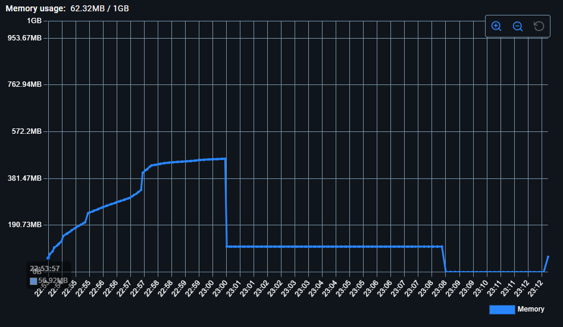

# tsm-adv-daba

## Information

etudiant: Loïc Frossard

group:25-adv-daba-frossard

namespace:tsm-daba

pod-id-neo4j:

neo4j-user:neo4j
neo4j-password:testtest

git: https://github.com/petitBiscuits/TSM-AdvDaBa-ne04j

## Approche

Je me suis renseigné sur les meilleures façons de charger des données dans Neo4j tout en minimisant la consommation mémoire.

Je suis tombé sur la méthode du bulk import, mais je n’ai pas réussi à la faire fonctionner. 
Surtout, elle ne fonctionne que lorsque le serveur est arrêté et qu’il n’y a aucune donnée existante dans la base.

Je me suis donc tourné vers une deuxième solution : l’utilisation des fonctions APOC.

## Rerun

### K8s
```
#Delete all
kubectl -n tsm-daba delete all --all
kubectl -n tsm-daba delete pvc --all
kubectl -n tsm-daba delete configmap --all
kubectl -n tsm-daba delete secret --all

# Delete the job
kubectl -n tsm-daba delete job dblp-loader-job

# inside the loader-config-map.yaml there is all the variable to change the behaviour
kubectl apply -f k8s/loader-config-map.yaml

# Reapply the job
kubectl apply -f k8s/loader-job.yaml
```

### local

```
docker-compose up neo4j -d
```

After the  neo4j as been started

```
docker-compose up neo4j -d
```

En local, cela utilise moins de 500MB de mémoire et il faut environ 40 à 50 minutes pour ajouter les 5 millions de nœuds.

